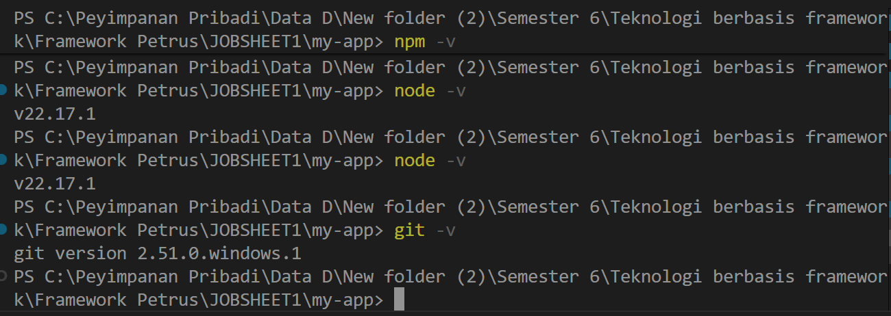
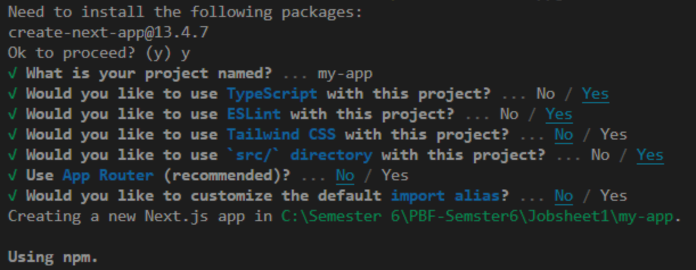
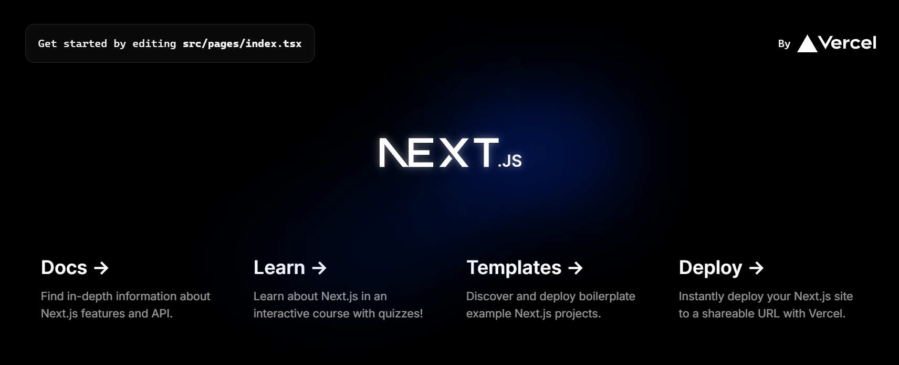
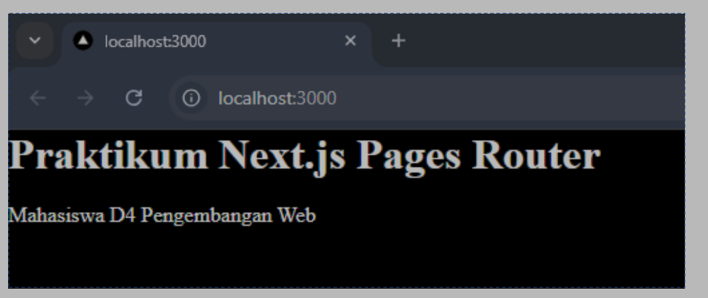
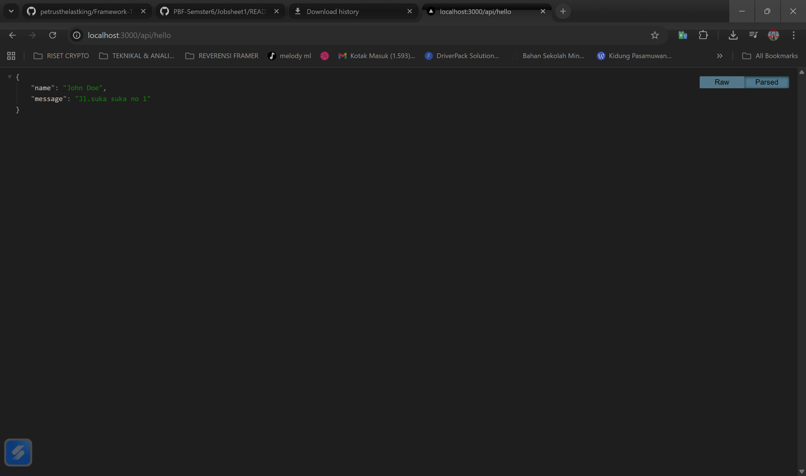
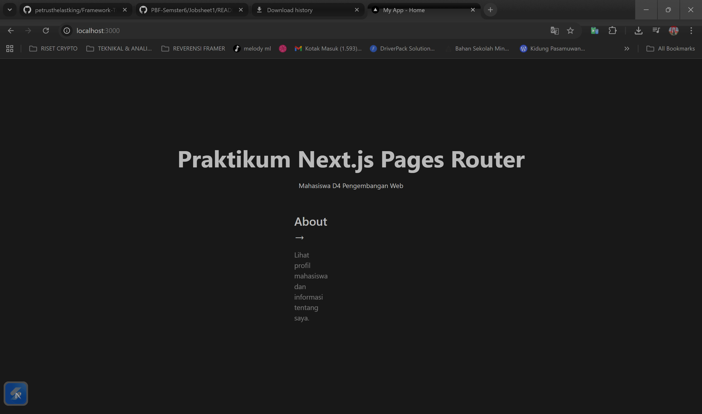

<div align="center">


# 📘 Laporan Praktikum


</div>

---

## 👨‍🎓 Identitas Mahasiswa

<table>
<tr>
<td><b>📚 Mata Kuliah</b></td>
<td>Pemrograman Berbasis Framework</td>
</tr>
<tr>
<td><b>🎓 Program Studi</b></td>
<td>Teknik Informatika</td>
</tr>
<tr>
<td><b>📅 Semester</b></td>
<td>6 (Genap)</td>
</tr>
<tr>
<td><b>📖 Praktikum</b></td>
<td>Jobsheet 01 - Setup Project Next.js menggunakan Pages Router</td>
</tr>
<tr>
<td><b>👤 Nama</b></td>
<td>Petrus Tyang Agung Rosario</td>
</tr>
<tr>
<td><b>🆔 NIM</b></td>
<td>2341720227</td>
</tr>
<tr>
<td><b>🏛️ Kelas</b></td>
<td>TI-3D</td>
</tr>
</table>

---

## 📚 Tujuan Praktikum

Praktikum ini bertujuan untuk:
- ✅ Memahami cara setup project Next.js menggunakan Pages Router
- ✅ Mengenal struktur folder dan file dalam project Next.js
- ✅ Mampu menjalankan development server Next.js
- ✅ Mampu melakukan modifikasi pada halaman dan komponen
- ✅ Memahami konsep API Routes di Next.js

---

## 📝 Langkah-Langkah Praktikum

<div align="center">

**Progress Praktikum**

```
██████████████████████████████████████  100%
```

🟢 **7 Langkah** | ✅ **Semua Selesai**

</div>

---

<details open>
<summary><h3>🔍 Langkah 1 - Pengecekan Lingkungan</h3></summary>

**Deskripsi:**

Pada langkah ini, dilakukan pengecekan terhadap lingkungan development yang diperlukan untuk menjalankan Next.js, seperti:
- ✔️ Node.js (versi yang direkomendasikan)
- ✔️ npm atau yarn package manager
- ✔️ Text editor (VS Code)

> 💡 **Tips:** Gunakan `node -v` dan `npm -v` untuk mengecek versi yang terinstall

**Hasil:**



</details>

---

<details open>
<summary><h3>📦 Langkah 2 - Membuat Project Next.js</h3></summary>

**Deskripsi:**

Membuat project Next.js baru menggunakan `create-next-app`. Perintah ini akan:
- 🔧 Setup struktur folder otomatis
- 📝 Menginstall dependencies yang diperlukan
- ⚙️ Konfigurasi TypeScript dan ESLint

> 💡 **Command:** `npx create-next-app@latest my-app`

**Hasil:**



</details>

---

<details open>
<summary><h3>🚀 Langkah 3 - Menjalankan Server Development</h3></summary>

**Deskripsi:**

Menjalankan development server dengan perintah `npm run dev`. Server akan berjalan di:
- 🌐 **URL**: http://localhost:3000
- 🔥 **Hot Reload**: Perubahan kode langsung terlihat
- 🐛 **Error Reporting**: Error ditampilkan di browser

> 💡 **Command:** `npm run dev` atau `yarn dev`

**Hasil:**



</details>

---

<details open>
<summary><h3>🎨 Langkah 5 - Modifikasi Halaman Utama</h3></summary>

**Deskripsi:**

Melakukan modifikasi pada halaman utama (`pages/index.tsx`) untuk:
- ✏️ Mengubah konten teks
- 🎨 Menyesuaikan tampilan
- 🧩 Memahami struktur komponen React

> 💡 **File:** `src/pages/index.tsx`

**Hasil:**



</details>

---

<details open>
<summary><h3>🔌 Langkah 6 - Modifikasi API</h3></summary>

**Deskripsi:**

Memodifikasi API route (`pages/api/hello.ts`) untuk memahami:
- 📡 Cara kerja API Routes di Next.js
- 🔄 Request dan Response handling
- 📤 Mengirim data JSON

> 💡 **File:** `src/pages/api/hello.ts`

**Hasil:**



</details>

---

<details open>
<summary><h3>🌈 Langkah 7 - Modifikasi Background</h3></summary>

**Deskripsi:**

Mengubah styling background aplikasi dengan:
- 🎨 Modifikasi file CSS
- 🖌️ Mengatur warna dan gradient
- ✨ Mempercantik tampilan UI

> 💡 **File:** `src/styles/globals.css` atau `src/app/globals.css`

**Hasil:**



</details>

---
## Pertanyaan Refleksi
1. Mengapa Pages Router disebut sebagai routing berbasis file?<br>
Jawab:<br>
Pages Router disebut routing berbasis file karena sistem routingnya bergantung langsung pada struktur file dan folder yang dibuat. Jadi setiap file yang kita buat di dalam folder pages/ akan otomatis menjadi sebuah route atau halaman di website. Misalnya, kalau bikin file about.tsx di dalam folder pages/, maka secara otomatis akan terbentuk route /about yang bisa diakses di browser. Ini sangat berbeda dengan React biasa yang memerlukan untuk mendefinisikan route secara manual menggunakan library seperti React Router. Dengan sistem file-based routing ini, kita tidak perlu repot-repot membuat konfigurasi routing yang rumit, cukup buat file di lokasi yang tepat dan Next.js akan menangani sisanya.
2. Apa perbedaan Next.js dengan React standar (CRA)?<br>
Jawab:<br>
Perbedaan utama Next.js dengan React standar atau Create React App adalah Next.js merupakan framework yang lebih lengkap dan powerful. React standar hanya melakukan rendering di sisi client atau browser, sehingga ketika halaman pertama kali dibuka, browser harus mendownload semua JavaScript, menjalankannya, baru kemudian konten muncul. Sedangkan Next.js bisa melakukan rendering di server (SSR), sehingga konten HTML sudah jadi di server dan langsung dikirim ke browser, membuat loading lebih cepat dan bagus untuk SEO.
Next.js sudah memiliki sistem routing bawaan yang berbasis file, sedangkan React standar harus menginstall React Router sendiri dan mengkonfigurasi secara manual. Next.js juga punya fitur API Routes yang memungkinkan kita membuat backend API dalam satu project yang sama, jadi tidak perlu setup server terpisah. Ada juga optimasi otomatis untuk gambar, code splitting otomatis, dan berbagai fitur production-ready lainnya yang di React standar harus kita setup sendiri. Intinya, Next.js itu seperti React yang sudah di-upgrade dengan banyak fitur tambahan untuk memudahkan development dan meningkatkan performa aplikasi.
3. Apa fungsi perintah npm run dev?<br>
Jawab:<br>
Perintah npm run dev mengaktifkan server lokal Next.js (biasanya di port 3000) untuk memantau perubahan kode secara real-time. Fitur Fast Refresh memastikan browser otomatis terupdate saat file disimpan, sementara Error Overlay memudahkan proses debugging dengan menampilkan pesan kesalahan yang detail secara langsung.
4. Apa perbedaan npm run dev dan run build ?<br>
Jawab:<br>
Gunakan npm run dev saat menulis kode untuk mendapatkan fitur hot reload dan debugging yang cepat. Sebaliknya, gunakan npm run build sebelum deploy untuk mengoptimasi, mengecilkan ukuran file, dan memastikan aplikasi berjalan ringan di tangan pengguna. Setelah di-build, jalankan npm start untuk mengaktifkan server produksinya.

## 🎯 Kesimpulan

Dari praktikum ini, dapat disimpulkan bahwa:

1. **Setup Project**: Next.js menyediakan CLI tool yang memudahkan pembuatan project dengan konfigurasi otomatis
2. **Pages Router**: Sistem routing berbasis file system yang intuitif dan mudah dipahami
3. **Development Server**: Hot reload membuat proses development lebih efisien
4. **API Routes**: Next.js memungkinkan pembuatan API endpoint dalam satu project
5. **Styling**: Berbagai cara styling dapat diterapkan (CSS Modules, Global CSS, dll)


---

<div align="center">

### ✅ Praktikum Selesai!


---

**Disusun oleh:**

### 👨‍💻 Petrus Tyang Agung Rosario

**NIM:** 2341720227 | **Kelas:** TI-3D

*Teknik Informatika - Politeknik Negeri Malang*

*Semester 6 | 2026*

---


</div>


