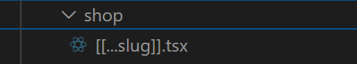
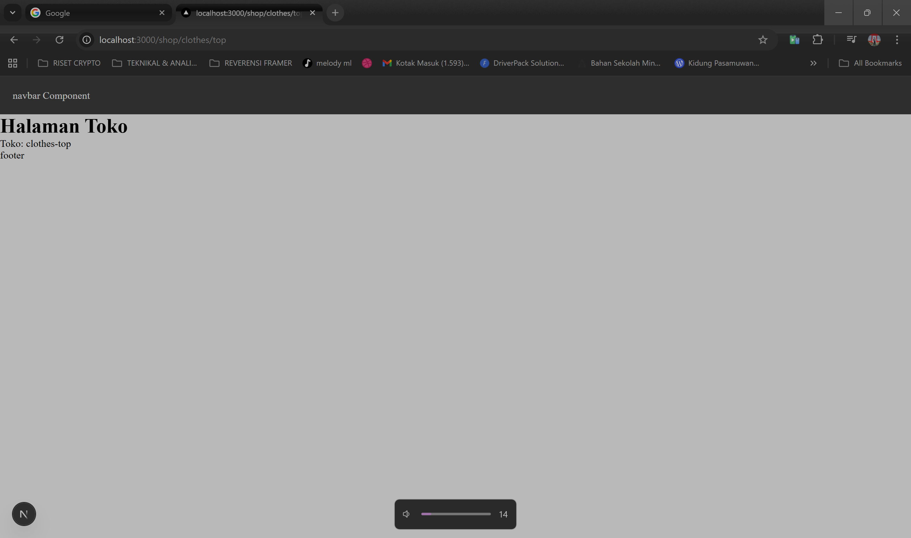
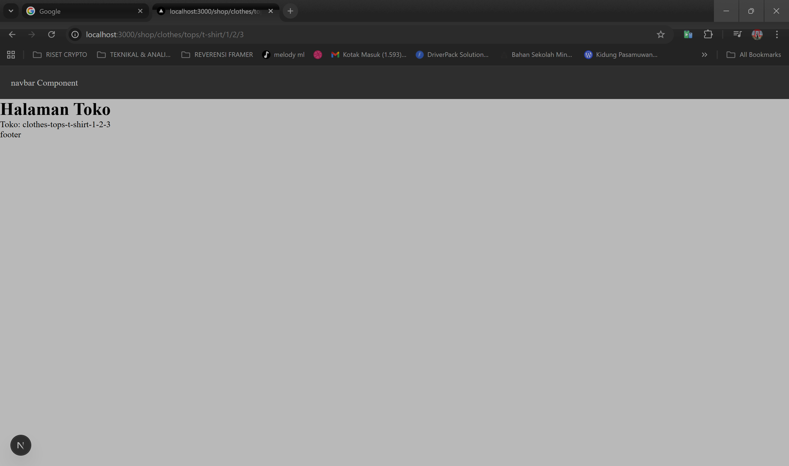
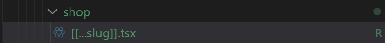
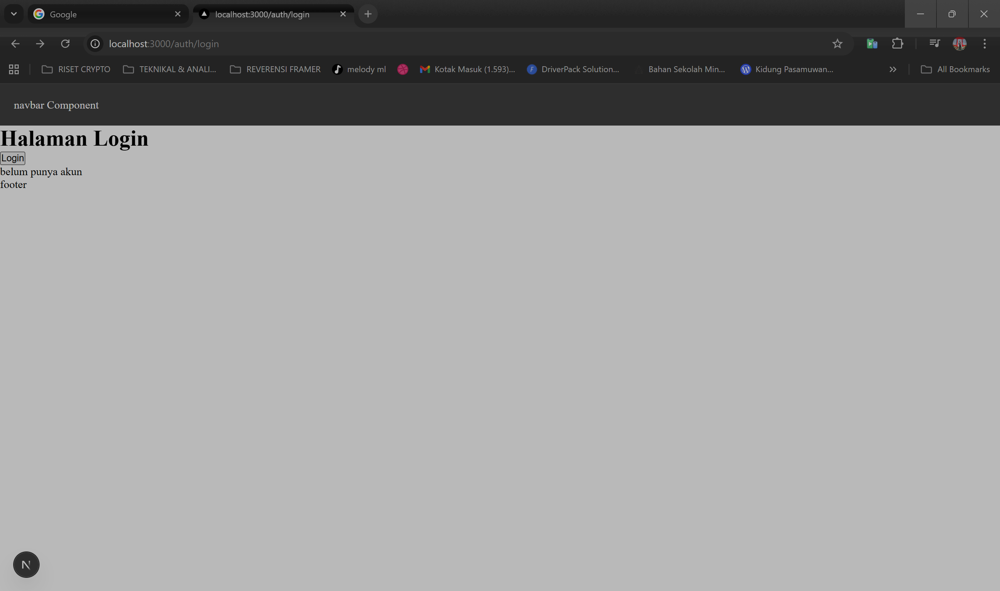
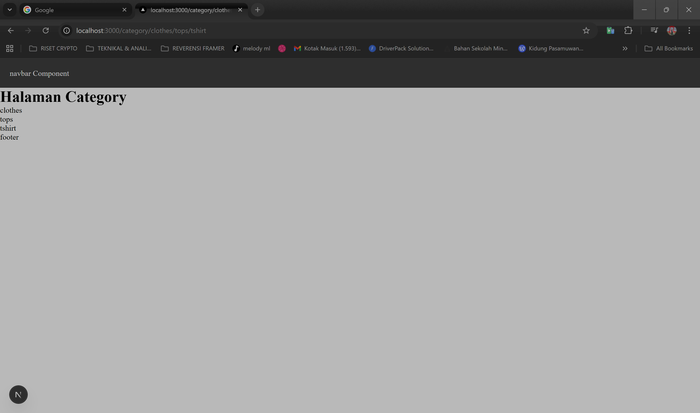

<div align="center">


# 📘 Laporan Praktikum


</div>

---

## 👨‍🎓 Identitas Mahasiswa

<table>
<tr>
<td><b>📚 Mata Kuliah</b></td>
<td>Pemrograman Berbasis Framework</td>
</tr>
<tr>
<td><b>🎓 Program Studi</b></td>
<td>Teknik Informatika</td>
</tr>
<tr>
<td><b>📅 Semester</b></td>
<td>6 (Genap)</td>
</tr>
<tr>
<td><b>📖 Praktikum</b></td>
<td>Jobsheet 04 - RCatch-All Routing, Optional Catch-All, Linking & Navigating pada Next.js Pages 
Router</td>
</tr>
<tr>
<td><b>👤 Nama</b></td>
<td>Petrus Tyang Agung Rosario</td>
</tr>
<tr>
<td><b>🆔 NIM</b></td>
<td>2341720227</td>
</tr>
<tr>
<td><b>🏛️ Kelas</b></td>
<td>TI-3D</td>
</tr>
</table>

---

## 📚 Tujuan Praktikum

Setelah menyelesaikan praktikum ini, mahasiswa mampu:
- ✅ Membuat catch-all route untuk menangkap banyak segmen URL.
- ✅ Menggunakan optional catch-all route agar halaman tetap dapat  diakses tanpa parameter.
- ✅ Mengambil parameter URL berbentuk array menggunakan useRouter
- ✅ Menerapkan navigasi antar halaman menggunakan Link
- ✅ Melakukan navigasi imperatif menggunakan router.push()
- ✅ Mengimplementasikan redirect sederhana berbasis kondisi (simulasi login).

---

## 📝 Langkah-Langkah Praktikum

<div align="center">

**Progress Praktikum**

```
██████████████████████████████████████  100%
```

🟢 **7 Langkah** | ✅ **Semua Selesai**

</div>

---

<details open>
<summary><h3>🔍 Langkah 2 – Membuat Catch-All Route</h3></summary>

**Deskripsi:**

1. Masuk ke folder pages.<br>
2. Buat folder shop dan file […slug].tsx:<br>
**Hasil:**<br>

3. Modifikasi Isi file […slug].tsx dengan kode berikut:<br>
**Hasil:**<br>

Modifikasi [...slug].tsx untuk menampilkan nilai query<br>

</details>

---

<details open>
<summary><h3>📦 Langkah 3 – Pengujian Catch-All Route</h3></summary>

**Deskripsi:**

Akses URL berikut di browser:<br>
/shop/clothes<br>
**Hasil:**<br>

/shop/clothes/top<br>
**Hasil:**<br>

/shop/clothes/tops<br>
**Hasil:**<br>


Jika dilihat ada yang terbaca undifined dan ada yang tidak terbaca ini dikarena segmennya dibatasi<br>
Cuma array[0] dan array[1]. Solusinya bagaimana ?<br>
Modifikasi […slug].tsx menjadi berikut<br>
**code:**<br>


Jalankan browser : Berapapun banyaknya seqment tetap terbaca<br>
**Hasil:**<br>

**Hasil:**<br>



</details>

---

<details open>
<summary><h3>🚀 Langkah 4 – Optional Catch-All Route </h3></summary>

**Deskripsi:**

1. Jika menggunakan [...slug].js maka ketika mengakses shop akan terjadi error<br>
**Hasil:**<br>


2. Solusinya dengan Rename file: [...slug].js → [[...slug]].js<br>


3. Sekarang akses:<br>
/shop<br>


</details>

---

<details open>
<summary><h3>🎨 Langkah 5 – Validasi Parameter</h3></summary>

**Deskripsi:**

Langkah 6 – Membuat Halaman Login & Register<br>
1. Buat folder:<br>
2. pages/auth<br>
3. Buat file:<br>
o login.jsx<br>
o register.jsx<br>

Modifikasi login.jsx:<br>

Modifikasi register.jsx:<br>

</details>

---

<details open>
<summary><h3>🔌 Langkah 7 – Navigasi Imperatif (router.push)</h3></summary>

**Deskripsi:**

Tambahkan button login:<br>

**Hasil:**<br>

**Hasil:**<br>


</details>

---

<details open>
<summary><h3>🌈 Langkah 8 – Simulasi Redirect (Belum Login)</h3></summary>

**Deskripsi:**

Di halaman product, pada index.tsx tambahkan beberapa code berikut:<br>

</details>

---

<details open>
<summary><h3>🌈 E. Tugas Praktikum</h3></summary>

**dokumentasi:**
Tugas 1 (Wajib)<br>
• Buat catch-all route:<br>
• /category/[...slug].js<br>
• Tampilkan seluruh parameter URL dalam bentuk list<br>


Tugas 2 (Wajib)<br>
• Buat navigasi:<br>
o Login → Product (imperatif)<br>
o Login ↔ Register (Link)<br>


Tugas 3 (Pengayaan)<br>
• Terapkan redirect otomatis ke login jika user belum login.<br>

</details>
---

## Pertanyaan Refleksi
1. Apa perbedaan [id].js dan [...slug].js?<br>
Jawab:<br>
[id].js menangkap satu segmen URL saja.
Contoh: /produk/123 -> id = "123"
[...slug].js adalah catch-all, menangkap banyak segmen.
Contoh: /shop/a/b/c -> slug = ["a","b","c"]
2. Mengapa slug berbentuk array?<br>
Jawab:<br>
Karena catch-all route bisa menerima lebih dari satu segmen path, maka Next.js mengirimnya sebagai array agar tiap segmen tetap terpisah dan mudah diolah (join, map, dll).
3. Kapan sebaiknya menggunakan Link dan router.push()?<br>
Jawab:<br>
Gunakan Link untuk navigasi deklaratif di UI (menu, tombol pindah halaman biasa).
Gunakan router.push() untuk navigasi imperatif dari logic/aksi (setelah submit form, setelah login, redirect berdasarkan kondisi).
4. Mengapa navigasi Next.js tidak me-refresh halaman?
Jawab:<br>
Karena Next.js melakukan client-side navigation (SPA behavior): hanya mengganti komponen halaman dan data yang perlu, bukan reload dokumen HTML penuh, jadi terasa cepat dan state tertentu bisa tetap terjaga.
<div align="center">

### ✅ Praktikum Selesai!


---

**Disusun oleh:**

### 👨‍💻 Petrus Tyang Agung Rosario

**NIM:** 2341720227 | **Kelas:** TI-3D

*Teknik Informatika - Politeknik Negeri Malang*

*Semester 6 | 2026*

---


</div>


