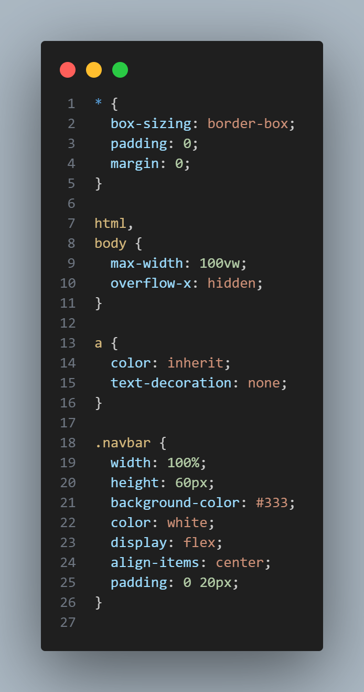

<div align="center">


# 📘 Laporan Praktikum


</div>

---

## 👨‍🎓 Identitas Mahasiswa

<table>
<tr>
<td><b>📚 Mata Kuliah</b></td>
<td>Pemrograman Berbasis Framework</td>
</tr>
<tr>
<td><b>🎓 Program Studi</b></td>
<td>Teknik Informatika</td>
</tr>
<tr>
<td><b>📅 Semester</b></td>
<td>6 (Genap)</td>
</tr>
<tr>
<td><b>📖 Praktikum</b></td>
<td>Jobsheet 04 - Styling pada Next.js (Global CSS, CSS Module, Inline Style, SCSS, dan Tailwind CSS)</td>
</tr>
<tr>
<td><b>👤 Nama</b></td>
<td>Petrus Tyang Agung Rosario</td>
</tr>
<tr>
<td><b>🆔 NIM</b></td>
<td>2341720227</td>
</tr>
<tr>
<td><b>🏛️ Kelas</b></td>
<td>TI-3D</td>
</tr>
</table>

---

## 📚 Tujuan Praktikum

Setelah mengikuti praktikum ini, mahasiswa mampu:
- ✅ Memahami berbagai pendekatan styling pada Next.js
- ✅ Menggunakan Global CSS dan memahami cakupannya
- ✅ Mengimplementasikan CSS Module (local scope)
- ✅ Menggunakan Inline Styling (CSS-in-JS) pada JSX
- ✅ Menggunakan SCSS (SASS) untuk manajemen style yang kompleks
- ✅ Melakukan refactoring struktur folder agar project lebih maintainable
- ✅ Mengintegrasikan Tailwind CSS pada Next.js Pages Router

---

## 📝 Langkah-Langkah Praktikum

<div align="center">

**Progress Praktikum**

```
██████████████████████████████████████  100%
```

🟢 **9 Langkah** | ✅ **Semua Selesai**

</div>

---

<details open>
<summary><h3>🔍 1. Global CSS</h3></summary>
<h4>a. File Global</h4>



<h4>b. Import Global CSS</h4>
// pages/_app.tsx<br>
import "@/styles/globals.css";

.png>)

**Deskripsi:**<br>
Penerapan Global CSS di Next.js diawali dengan membuat file globals.css untuk menentukan standar desain dasar. Di dalamnya, selektor bintang digunakan untuk menghapus margin dan padding bawaan agar tata letak tetap konsisten. Elemen body diatur supaya pas dengan lebar layar, sementara class .navbar didesain gelap dengan flexbox agar rapi. Agar gaya ini aktif, file tersebut wajib di-import ke dalam _app.tsx. Karena ini adalah induk aplikasi, semua desain otomatis berlaku di tiap halaman agar tetap seragam.
</details>

---

<details open>
<summary><h3>📦 2. CSS Module (Local Scope)</h3></summary>
<h4>a. Struktur Komponen Navbar</h4>
src/components/layout/Navbar/<br>
├── index.tsx<br>
└── Navbar.module.css

(a. Struktur Komponen Navbar).png>)

<h4>b. File CSS Module</h4>

- Modifikasi global.css

(b. File CSS Module)(Modifikasi global.css).png>)

- Modifikasi navbar.module.css

(b. File CSS Module)(Modifikasi navbar.module.css).png>)

<h4>b. File CSS Module</h4>

- Modifikasi kode pada index.tsx pada folder navbar

(c. Pemanggilan di Komponen)(Modifikasi kode pada index.tsx pada folder navbar).png>)

- Jalankan browser

(c. Pemanggilan di Komponen)(Jalankan browser).png>)

**Deskripsi:**<br>
CSS Module adalah metode styling di Next.js yang utama karena kemampuannya menciptakan lingkup lokal (Local Scope). Setiap class CSS yang didefinisikan dalam modul akan menjadi unik, sehingga mencegah terjadinya bentrokan antar class meskipun memiliki nama yang sama di komponen yang berbeda. Keunggulan ini membuat CSS Module sangat ideal untuk mengembangkan komponen yang bisa dipakai ulang (reusable) di seluruh aplikasi. Untuk mengimplementasikannya, nama file CSS harus menggunakan format [nama].module.css.
</details>

---

<details open>
<summary><h3>🚀 3. Styling untuk Pages (CSS Module) </h3></summary>

<h4>a. Contoh Login Page</h4>

- Modifikasi login.module.css

(a. Contoh Login Page)(Modifikasi login.module.css).png>)

- Modifikasi login.tsx

(a. Contoh Login Page)(Modifikasi login.tsx).png>)

- Jalankan browser

(a. Contoh Login Page)(Jalankan browser).png>)


**Deskripsi:**<br>
Styling untuk Pages menggunakan CSS Module diterapkan untuk memberikan gaya spesifik pada suatu halaman, seperti Halaman Login. Langkahnya meliputi penambahan file **login.module.css** di folder page, yang berisi class untuk mengatur tata letak halaman, misalnya menengahkan konten. Kemudian, style ini diimpor dan diterapkan pada elemen utama halaman tersebut. Hasilnya, halaman akan memiliki tampilan yang spesifik dan terisolasi.
</details>

---

<details open>
<summary><h3>🎨 4. Conditional Rendering Navbar (Tanpa Navbar di Login)</h3></summary>

<h4>a. Contoh Login Page</h4>

- Modifikasi index.tsx pada folder Appsheel<br>
o import { useRouter } from "next/router";<br>
o const disableNavbar = ["/auth/login", "/auth/register"];<br>
o const {pathname} = useRouter();<br>
o {!disableNavbar.includes(router.pathname) && <Navbar />}<br>

(Modifikasi index.tsx pada folder Appsheel).png>)

-  Jalankan Browser

(Jalankan browser).png>)

**Deskripsi:**<br>
Conditional Rendering Navbar (Tanpa Navbar di Login) merupakan teknik yang diterapkan di dalam komponen AppShell untuk mengatur kapan Navbar akan ditampilkan kepada pengguna. Tujuannya adalah untuk menyembunyikan Navbar pada halaman-halaman yang tidak memerlukannya, seperti halaman Login dan Register. Untuk melakukannya, digunakan hook useRouter dari Next.js untuk mendapatkan pathname atau lokasi halaman saat ini. Selanjutnya, dibuat daftar halaman yang dikecualikan (misalnya /auth/login dan /auth/register), dan Navbar baru akan dirender jika pathname saat ini tidak termasuk dalam daftar pengecualian tersebut.

</details>

---

<details open>
<summary><h3>5. Refactoring Struktur Project (Best Practice)</h3></summary>

<h4>a. Contoh Login Page</h4>

- b. Struktur Refactor (Disarankan)<br>
pages/auth/login.tsx<br>
src/views/auth/Login/<br>
├── index.tsx<br>
└── Login.module.css<br>

(b. Struktur Refactor (Disarankan))().png>)

- Modifikasi login.module.css pada folder view/auth/login/<br>

(b. Struktur Refactor (Disarankan))(Modifikasi login.module.css).png>)

- Modifikasi index.tsx pada folder views/auth/login<br>

(b. Struktur Refactor (Disarankan))(Modifikasi index.tsx pada folder).png>)

- Jalankan browser<br>

(b. Struktur Refactor (Disarankan))(Jalankan).png>)

**Deskripsi:**<br>
Refactoring Struktur Project (Best Practice) adalah praktik penataan ulang folder proyek dengan memisahkan logika routing yang ada di folder pages dengan komponen tampilan (views) yang lebih kompleks. Pada struktur yang disarankan, file di folder pages hanya berfungsi sebagai router yang akan memanggil komponen tampilan, sementara kode tampilan beserta styling CSS Module-nya dipindahkan ke folder src/views. Manfaat utama dari refactoring ini adalah menjaga agar routing tetap bersih, memisahkan logika dengan tampilan (Logic & UI terpisah), dan menjadikan proyek lebih mudah dikembangkan (maintainable).
</details>

---

<details open>
<summary><h3>6. Inline Styling (CSS-in-JS)</h3></summary>

<h4>a. Contoh Login Page</h4>

- Modifikasi index.tsx pada folder views/auth/login<br>
>o ***<h1 style={{ color: "red",borderRadius: "10px",padding: "10px",}}>***

(Modifikasi index.tsx pada folder).png>)

- Jalankan browser<br>

(JALANKAN).png>)

**Deskripsi:**<br>
Inline Styling atau yang dikenal sebagai CSS-in-JS adalah cara memberikan gaya CSS secara langsung pada elemen JSX dengan menggunakan objek JavaScript di dalam atribut
> style

. Penulisan properti CSS-nya harus menggunakan notasi camelCase contohnya

> borderRadius

. Metode ini cocok untuk styling yang kecil dan bersifat dinamis, namun tidak disarankan untuk digunakan pada layout yang besar karena dapat membuat kode sulit dikelola.
</details>

---

<details open>
<summary><h3>7. Kombinasi Global CSS + CSS Module</h3></summary>

<h4>a. Contoh Login Page</h4>

- Modifikasi global.css<br>

.png>)

- Modifikasi index.tsx pada folder components/layouts/navbar<br>
> o ***``<div className=”big”>navbar</~div>``***

.png>)

**Deskripsi:**<br>
Kombinasi Global CSS dan CSS Module adalah strategi styling yang menggabungkan kedua pendekatan tersebut dalam satu komponen. Global CSS digunakan untuk mendefinisikan utility atau gaya yang bersifat umum dan berlaku di seluruh aplikasi, misalnya seperti class .big untuk ukuran font. Sementara itu, CSS Module digunakan khusus untuk styling yang spesifik pada sebuah komponen, seperti pada Navbar. Di dalam komponen, class dari Global CSS dan CSS Module dapat dipanggil bersamaan melalui atribut className, sehingga gaya spesifik komponen tetap terisolasi, dan utilitas umum dapat diakses dengan mudah.

</details>


<details open>
<summary><h3>🌈 8. SCSS (SASS)</h3></summary>
<h4>a. Install SASS</h4>

- Cek pada package.css jika berhasil mak akan muncul seperti pada gambar<br>

(a. Install SASS).png>)

<h4>b. Global Variable</h4>

- Tambahkan colors.scss pada folder styles<br>

(b. Global Variable)(Tambahkan colors.scss pada folder styles).png>)

- Modifikasi colors.scss<br>

(b. Global Variable)(Modifikasi colors.scss).png>)

<h4>c. Gunakan di Module</h4>

- Tambahkan file login.module.scss pada folder views/auth/login/<br>

(c. Gunakan di Module)(Tambahkan file login.module.scss pada folder).png>)

- Modifikasi index.tsx<br>
o Tambahkan import styles from login.module.scss<br>
o Disable import styles from login.module.css<br>

(c. Gunakan di Module)(Modifikasi index.tsx).png>)

- Modifikasi index.tsx<br>

(c. Gunakan di Module)(Modifikasi login.module.scss).png>)

- Jalankan browser<br>

(c. Gunakan di Module)(Jalankan browser).png>)

**Deskripsi:**<br>
SCSS (SASS) adalah preprocessor CSS yang digunakan di Next.js untuk membuat manajemen style lebih terstruktur dan scalable. Implementasinya memerlukan instalasi SASS sebagai devDependencies. SCSS memungkinkan pembuatan global variable untuk menyimpan nilai yang sering digunakan seperti skema warna, font, atau ukuran di satu tempat. Penggunaan SASS dilakukan dengan membuat file berekstensi

> .module.scss 

di mana variabel global dapat diimpor dan diakses menggunakan fungsi

> map-get 

Keunggulan SCSS meliputi penggunaan Variable dan Nested Rule yang membuat struktur CSS mengikuti struktur HTML, sehingga menjadikannya maintainable untuk proyek skala besar.

</details>

<details open>
<summary><h3>🌈 9. Tailwind CSS</h3></summary>

<h4>b. Konfigurasi tailwind.config.js</h4>

.png>)

<h4>c. Import di Global CSS</h4>
o @tailwind base;<br>
o @tailwind components;<br>
o @tailwind utilities;<br>

.png>)

<h4>d. Contoh Penggunaan</h4>

- Modifikasi index.tsx pada folder auth/login/<br>
> o ``<h1 className="text-3xl font-bold text-blue-600 ">HalamanLogin</h1>``

(1).png>)

- Jalankan browser<br>

(2).png>)
**Deskripsi:**<br>
Tailwind CSS adalah sebuah framework CSS utility-first yang populer dan terintegrasi dengan Next.js, yang memiliki keunggulan utama dalam mempercepat proses styling dan membuat tampilan lebih konsisten. Langkah implementasinya dimulai dari instalasi Tailwind CSS, PostCSS, dan Autoprefixer sebagai devDependencies. Setelah instalasi, dilakukan inisialisasi dengan perintah

> ***npx tailwindcss init -p***

untuk menghasilkan file konfigurasi. Selanjutnya, file

> ***tailwind.config.js***

dikonfigurasi untuk memindai lokasi file yang memerlukan utility class, dan direktif Tailwind seperti

> ***@tailwind base***

> ***@tailwind components***

> ***@tailwind utilities***

diimpor ke dalam file Global CSS. Penggunaan Tailwind dilakukan dengan menambahkan class utilitas langsung pada atribut

> ***className***

elemen JSX, contohnya

> ***className="text-3x1 font-bold text-blue-600***

. Solusi untuk error saat inisialisasi adalah dengan melakukan downgrade versi Tailwind CSS.
</details>


<details open>
<summary><h3>🌈 E. Tugas Praktikum</h3></summary>

.png>)
.png>)
.png>)
.png>)
.png>)
.png>)
.png>)
.png>)
**dokumentasi:**

</details>
---

## Pertanyaan Refleksi
1. Kapan sebaiknya menggunakan CSS Module dibanding Global CSS?<br>
Jawab:<br>
CSS Module sebaiknya digunakan ketika styling bersifat spesifik untuk satu komponen tertentu, misalnya Card, Navbar, atau Modal. Karena CSS Module menciptakan scope lokal secara otomatis, class tidak akan bentrok dengan komponen lain meskipun namanya sama. Sebaliknya, Global CSS lebih tepat digunakan untuk styling yang bersifat universal di seluruh aplikasi, seperti reset CSS, font dasar, warna tema, atau utility class seperti `.big`. Singkatnya: gunakan CSS Module untuk komponen, gunakan Global CSS untuk gaya keseluruhan aplikasi.

2. Apa kelemahan inline styling?<br>
Jawab:<br>
Inline styling memiliki beberapa kelemahan utama:
- **Tidak bisa menggunakan pseudo-class** seperti `:hover`, `:focus`, atau `:active` karena inline style tidak mendukungnya.
- **Tidak bisa menggunakan media query** untuk responsive design secara langsung.
- **Kode menjadi verbose dan sulit dibaca** ketika properti CSS semakin banyak, karena semua style tercampur dengan logika JSX.
- **Tidak bisa di-reuse**, setiap elemen harus mendefinisikan ulang style yang sama sehingga melanggar prinsip DRY (Don't Repeat Yourself).
- **Performa lebih rendah** karena style dihitung ulang setiap re-render, berbeda dengan CSS Module yang sudah di-hash saat build time.

3. Mengapa SCSS cocok untuk project skala besar?<br>
Jawab:<br>
SCSS cocok untuk project skala besar karena menawarkan fitur-fitur yang tidak dimiliki CSS biasa:
- **Variable** — nilai seperti warna, ukuran, dan font dapat disimpan dalam satu tempat (`$primary-color: #3498db`) sehingga mudah diubah secara konsisten di seluruh project.
- **Nesting** — aturan CSS dapat ditulis mengikuti struktur HTML yang bersarang, membuat kode lebih terorganisir dan mudah dibaca.
- **Mixin & Function** — blok style yang sering digunakan dapat dibungkus menjadi mixin dan dipanggil ulang, mengurangi duplikasi kode.
- **Modularisasi dengan @use** — style dapat dipecah ke banyak file kecil lalu digabungkan, memudahkan kolaborasi tim dan pemeliharaan jangka panjang.
- **Map & Loop** — memungkinkan pembuatan style yang dinamis dan sistematis seperti skema warna atau breakpoint.

4. Apa keunggulan Tailwind dibanding CSS tradisional?<br>
Jawab:<br>
Tailwind CSS memiliki beberapa keunggulan signifikan dibanding CSS tradisional:
- **Utility-first** — class seperti `text-xl`, `font-bold`, `bg-blue-500` langsung diterapkan di JSX tanpa perlu menulis file CSS terpisah, sehingga pengembangan lebih cepat.
- **Tidak ada naming class** — developer tidak perlu memikirkan nama class yang semantik, mengurangi cognitive load.
- **File CSS sangat kecil** — Tailwind secara otomatis menghapus class yang tidak digunakan saat build, menghasilkan file CSS yang ringan di production.
- **Konsistensi desain** — semua nilai (warna, spacing, ukuran) sudah terdefinisi dalam design system Tailwind, sehingga tampilan lebih konsisten tanpa perlu style guide manual.
- **Responsive dan dark mode mudah** — cukup tambahkan prefix seperti `sm:`, `md:`, atau `dark:` di depan class untuk mengatur tampilan responsif dan dark mode.

<div align="center">

### ✅ Praktikum Selesai!


---

**Disusun oleh:**

### 👨‍💻 Petrus Tyang Agung Rosario

**NIM:** 2341720227 | **Kelas:** TI-3D

*Teknik Informatika - Politeknik Negeri Malang*

*Semester 6 | 2026*

---


</div>


